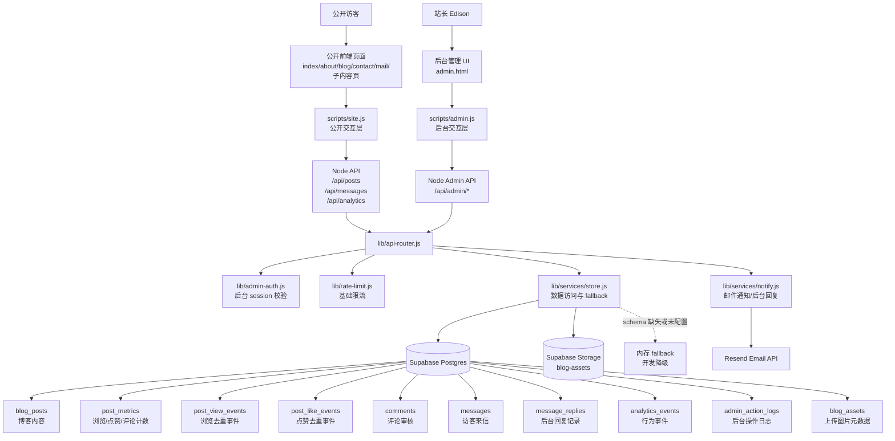
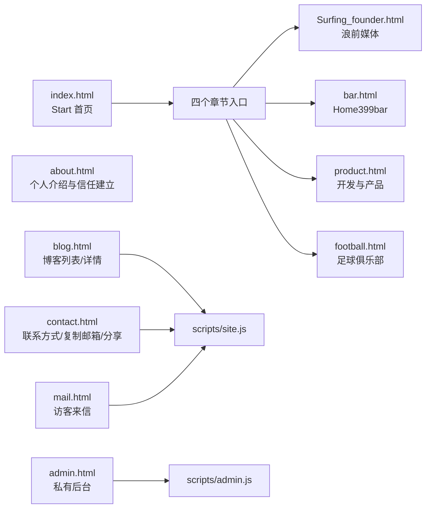
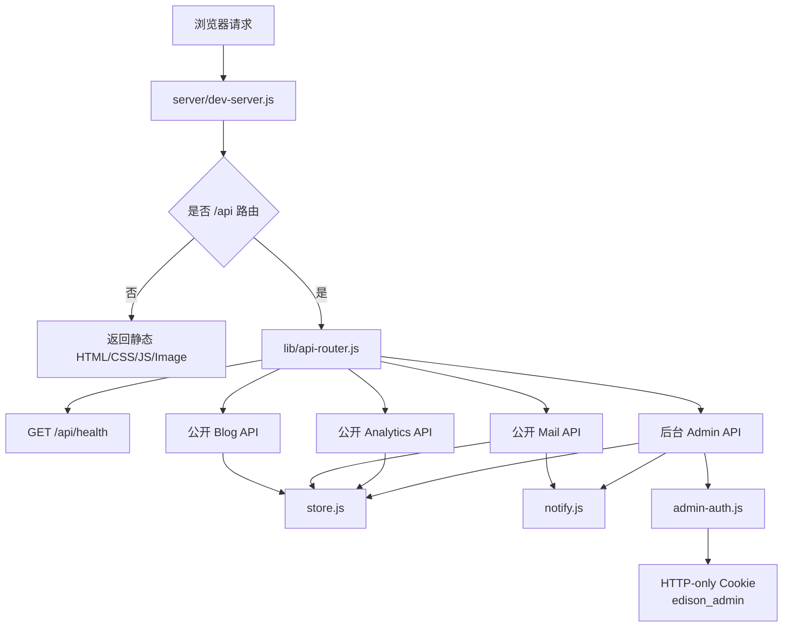
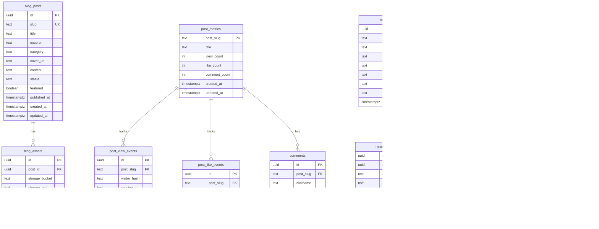
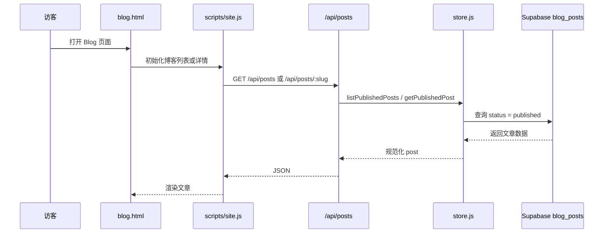
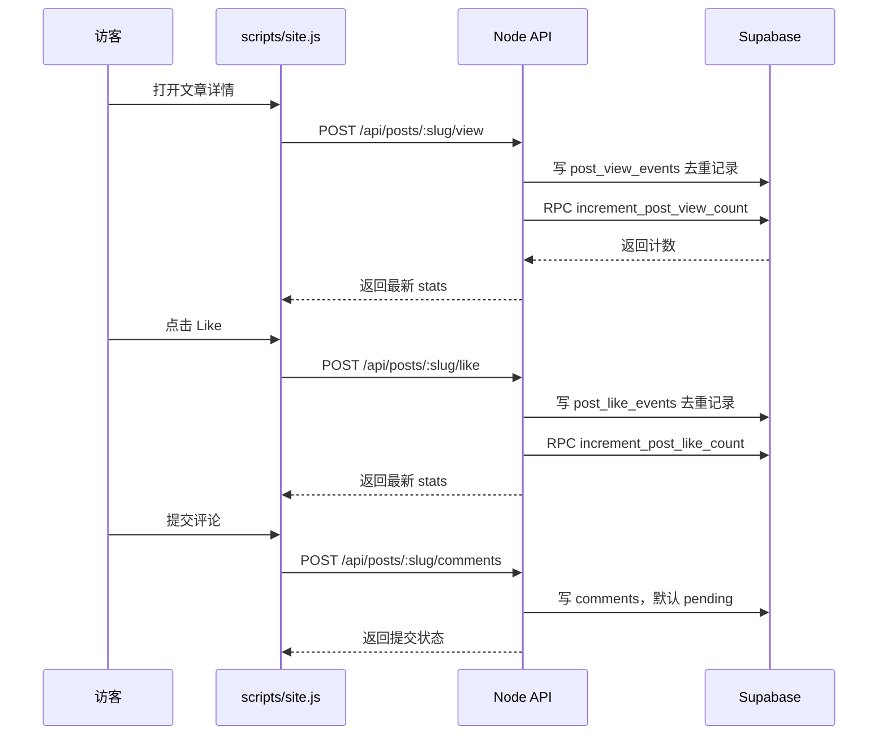
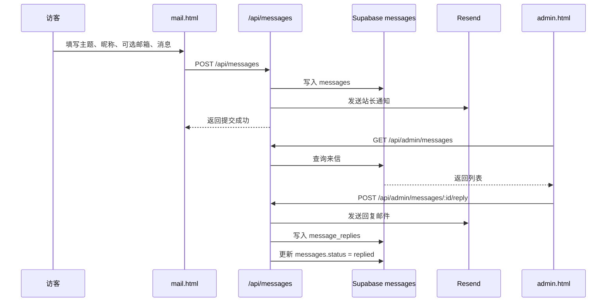
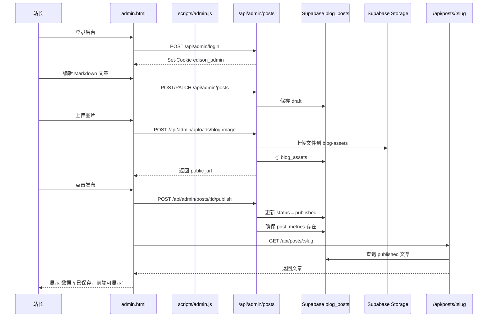

# Edison 个人网站 V2 产品说明

生成时间：2026-04-15

## 1. 当前产品定位

Edison 个人网站 V2 是一个“个人品牌展示 + 内容沉淀 + 访客互动 + 后台运营”的轻量产品。

当前版本没有重写为完整重型框架，而是在静态前端基础上增加 Node 轻量后端、Supabase 数据库、Supabase Storage、Resend 邮件能力，并保留后续迁移到 Next.js / Vercel 的空间。

核心目标：

- 对外展示 Edison 的个人身份、项目、内容和联系方式。
- 通过 Blog 沉淀观点、过程和复盘。
- 通过 Mail 收集匿名或半匿名访客输入。
- 通过后台管理 UI 查看数据、管理博客、回复访客。
- 用 Supabase 作为统一数据源，逐步替代硬编码内容。

## 2. 当前仓库结构概览

```text
Edison_web/
  index.html                  # Start 首页
  about.html                  # About 页面
  blog.html                   # Blog 列表与详情页面
  contact.html                # Contact 页面
  mail.html                   # Mail 访客来信页面
  admin.html                  # 私有后台管理 UI
  Surfing_founder.html        # 子内容页：浪前媒体
  bar.html                    # 子内容页：Home399bar
  product.html                # 子内容页：开发与产品
  football.html               # 子内容页：足球俱乐部
  styles/site.css             # 全站样式
  scripts/site.js             # 公开站点交互与 API 调用
  scripts/admin.js            # 后台管理交互与 API 调用
  scripts/posts.js            # Blog 静态 fallback 数据
  server/dev-server.js        # 静态文件服务 + API 路由入口
  lib/api-router.js           # 后端 API 路由
  lib/services/store.js       # Supabase / 内存 fallback 数据服务
  lib/services/notify.js      # Resend 邮件通知与回复
  lib/services/supabase.js    # Supabase service role client
  lib/admin-auth.js           # 后台密码登录与 session cookie
  lib/http.js                 # JSON、cookie、session、visitor hash 工具
  lib/rate-limit.js           # 基础内存限流
  supabase/schema.sql         # Phase Two 数据表与 RPC
  supabase/phase-three-schema.sql # Blog CMS / 后台 / Storage schema
  supabase/admin-queries.sql  # 手动运营查询
  tasks/todo.md               # 阶段任务与验收记录
  tasks/lessons.md            # 项目教训与防错规则
```

## 3. 产品架构 Mermaid 图



## 4. 前端页面与职责



前端当前由静态 HTML、CSS、原生 JS 组成：

- `index.html`：网站入口，保留主导航和四个章节模块。
- `about.html`：建立个人信任，展示身份、经历、项目和关注方向。
- `blog.html`：同一页面承载博客列表和详情，使用 `blog.html?slug=xxx` 作为文章路由。
- `contact.html`：展示联系方式，支持复制邮箱、分享和外链点击事件上报。
- `mail.html`：访客提交消息，可选留下回复邮箱。
- `admin.html`：私有后台，登录后管理文章、图片、来信和数据。
- `Surfing_founder.html`、`bar.html`、`product.html`、`football.html`：Start 页四个章节的子内容页。

## 5. 后端 API 架构



公开 API：

- `GET /api/health`：检查服务、Supabase 配置和当前存储模式。
- `GET /api/posts`：返回已发布博客列表。
- `GET /api/posts/:slug`：返回指定已发布博客详情。
- `GET /api/posts/stats?slugs=...`：批量返回文章浏览、点赞、评论数。
- `POST /api/posts/:slug/view`：记录文章浏览，按访客和日期去重。
- `POST /api/posts/:slug/like`：记录点赞，按访客去重。
- `GET /api/posts/:slug/comments`：读取已发布评论。
- `POST /api/posts/:slug/comments`：提交评论，默认进入 pending。
- `POST /api/messages`：提交访客来信，写入 Supabase，并通过 Resend 通知站长。
- `POST /api/analytics`：记录站点行为事件。

后台 API：

- `GET /api/admin/session`：检查后台是否配置、当前是否登录。
- `POST /api/admin/login`：后台密码登录，写入 HTTP-only session cookie。
- `POST /api/admin/logout`：退出后台。
- `GET /api/admin/metrics/posts`：查看文章数据和互动率。
- `GET /api/admin/messages`：查看来信列表。
- `GET /api/admin/messages/:id`：查看来信详情和回复历史。
- `PATCH /api/admin/messages/:id`：更新来信状态。
- `POST /api/admin/messages/:id/reply`：通过 Resend 回复访客，并写入回复记录。
- `GET /api/admin/posts`：查看所有文章，包括草稿、已发布、归档。
- `POST /api/admin/posts`：创建草稿。
- `PATCH /api/admin/posts/:id`：编辑文章。
- `POST /api/admin/posts/:id/publish`：发布文章，并确保 metrics 行存在。
- `POST /api/admin/posts/:id/archive`：归档文章，不硬删除数据。
- `POST /api/admin/uploads/blog-image`：上传博客图片到 Supabase Storage。

## 6. 数据库与存储 Mermaid 图



当前 Supabase 数据层分三类：

- 内容层：`blog_posts`、`blog_assets`、Supabase Storage `blog-assets`。
- 互动层：`post_metrics`、`post_view_events`、`post_like_events`、`comments`、`messages`、`message_replies`。
- 运营层：`analytics_events`、`admin_action_logs`。

## 7. 核心业务流程 Mermaid 图

### 7.1 公开 Blog 读取流程



### 7.2 Blog 浏览/点赞/评论流程



### 7.3 Mail 来信与后台回复流程



### 7.4 后台发布博客流程



## 8. 现有功能介绍

### 8.1 公开站点

- 首页 Start：通过四个章节入口承接不同身份和项目线索。
- About：展示个人背景、项目能力和信任信息。
- Blog：支持列表和详情页，文章数据优先来自 Supabase `blog_posts`。
- Blog 详情：支持浏览量、点赞、评论读取与提交。
- Contact：支持外链、复制邮箱、分享页面，并记录交互事件。
- Mail：支持访客提交消息，可选填写回复邮箱；消息会进入 Supabase，并触发邮件通知。
- 子内容页：四个章节已经有独立 HTML 页面，便于后续扩展为更完整项目故事页。

### 8.2 后台管理

- 后台入口：`admin.html`。
- 后台登录：单 owner 密码登录，使用 HTTP-only cookie 保存 session。
- 数据总览：展示总浏览、总点赞、来信数量、已发布文章数量、未处理来信数量。
- Blog Metrics：按文章查看浏览、点赞、评论和互动率。
- Mail Inbox：查看来信列表、详情、回复邮箱、状态和回复历史。
- 后台回复：通过 Resend 回复访客，并写入 `message_replies`。
- Blog CMS：创建草稿、编辑标题/slug/分类/摘要/封面/Markdown 正文。
- Markdown 预览：后台内置轻量 Markdown 预览。
- 发布验证：发布后会检查数据库状态和公开 API 可见性，成功才显示“前端可显示”。
- 图片上传：上传博客图片到 Supabase Storage `blog-assets`，并写入 `blog_assets`。
- 归档：文章可归档隐藏，不默认硬删除历史数据。
- 操作日志：后台写操作会进入 `admin_action_logs`。

### 8.3 数据与安全

- Supabase service role key 只在服务端使用，不暴露给浏览器。
- 管理后台 API 全部走 `/api/admin/*`，由 `requireAdmin` 保护。
- 写操作有 same-origin 检查。
- 公开交互有基础内存限流。
- Mail 和评论有 honeypot 字段，降低简单机器人提交。
- 浏览和点赞使用 visitor hash 做基础去重。
- 数据库启用 RLS；当前服务端使用 service role 进行受控写入。
- 若 Supabase schema 缺失或未配置，后端有内存 fallback，便于开发调试。

## 9. 当前版本已验证能力

已在本地验证过的能力：

- 静态页面可通过 Node dev server 返回。
- `/api/health` 可检查 Supabase active 状态。
- Supabase Phase Two 表可通过 `npm run db:verify` 检查。
- Supabase Phase Three 表和 `blog-assets` bucket 可通过 `npm run db:verify` 检查。
- `npm run db:seed` 可补齐初始文章 metrics，且不会降低已有计数。
- Blog 浏览、点赞、评论、Mail 提交、Analytics 事件写入已验证。
- Resend 来信通知和后台回复已验证。
- 后台创建草稿、上传图片、发布、公开可见、归档隐藏已验证。
- 后台 session 失效时，UI 会提示重新登录。

## 10. 当前风险与限制

- 当前仍是静态 HTML + 原生 JS 架构，复杂度继续增加后，前端状态管理和组件复用会变差。
- Blog Markdown 渲染器是轻量自研版本，不等同于完整 MDX/Markdown 生态。
- Admin UI 仍是单页原生 JS，随着功能增长会变得难维护。
- 当前评论只支持提交和公开读取，后台评论审核 UI 还不完整。
- 当前 analytics 只负责采集，没有完整可视化看板。
- Resend 使用 Gmail 作为回复身份时可能受 sender/domain 验证限制，正式上线需要确认发件域名策略。
- 之前开发过程中暴露过真实密钥，公开部署前需要轮换 Supabase 与 Resend keys。
- 当前本地运行依赖 Node server；部署到 Vercel 时需要转换为 Vercel Functions 或迁移到 Next.js Route Handlers。
- 当前没有自动化端到端浏览器测试，只做了 API/smoke 级验证。

## 11. 下一步功能设想

### 11.1 短期优先级

- 评论后台审核：在 `admin.html` 增加评论列表、状态切换、隐藏/发布操作。
- Blog 编辑体验增强：支持保存状态更明显、离开页面前提醒、草稿自动保存。
- 图片管理：后台展示已上传图片列表，支持复制 URL、按文章筛选、补充 alt text。
- 文章预览链接：草稿状态支持后台预览，不暴露给公开用户。
- 消息筛选：Mail Inbox 增加状态筛选、搜索、按是否可回复筛选。
- 管理后台日志查看：可在 UI 中查看 `admin_action_logs`，方便回溯操作。

### 11.2 中期能力

- Analytics Dashboard：将 `analytics_events` 转成可视化图表，例如页面访问、Start 点击、Contact 外链点击、Mail 转化。
- 内容分类页：Blog 支持按 category/tag 筛选。
- SEO 基础增强：为每篇 Blog 生成更完整 meta 信息、Open Graph 图片和 canonical URL。
- RSS / Sitemap：为公开 Blog 输出 RSS 与 sitemap，利于搜索引擎收录。
- 更完整的 Markdown：支持图片、链接、引用、代码块、表格，并统一公开端和后台端渲染规则。
- 后台多 tab 布局：把数据、来信、博客、图片、设置拆成更清晰的后台信息架构。

### 11.3 上线与工程化

- Vercel 部署：将当前 Node API 迁移为 Vercel Serverless Functions，或整体迁移到 Next.js。
- 环境变量治理：区分 local、preview、production，明确 public key 和 service key 边界。
- Secret 轮换：上线前轮换已暴露的 Supabase 和 Resend 密钥。
- 自动化测试：增加 API smoke、admin publish flow、public blog visibility 的脚本化测试。
- 数据库迁移管理：用版本化 migration 替代手动 SQL 复制执行。
- 监控与告警：对 Mail 提交失败、Resend 失败、Supabase 错误增加日志和告警。

## 12. 建议的 V3 产品方向

V3 不建议继续无边界堆功能，而应聚焦“个人网站作为可运营内容资产”的能力。

建议方向：

- 把 Blog 从“文章展示”升级为“内容资产库”：分类、标签、系列、搜索、推荐。
- 把 Contact/Mail 从“联系入口”升级为“轻 CRM”：消息来源、状态、回复记录、后续跟进。
- 把 Analytics 从“事件采集”升级为“运营判断”：访问趋势、内容表现、访客行动路径。
- 把 Admin 从“临时后台”升级为“稳定 CMS”：更好的编辑器、草稿预览、图片库、操作审计。
- 把部署从“本地可运行”升级为“线上可维护”：Vercel、域名、HTTPS、环境隔离、备份和监控。

## 13. 推荐下一步 Todo

- [ ] 完成评论审核后台 UI。
- [ ] 完成后台图片库 UI。
- [ ] 补充 `supabase/admin-queries.sql` 的恢复/排障 SQL。
- [ ] 增加 `scripts/admin-publish-smoke.js`，自动验证创建草稿、发布、公开可见、归档隐藏。
- [ ] 统一公开端和后台端 Markdown 渲染能力。
- [ ] 部署前轮换 Supabase / Resend 密钥。
- [ ] 规划 Vercel 部署方式：继续轻量 Node Functions，或迁移到 Next.js。
- [ ] 上线前补充生产环境 `.env` 清单和部署检查表。
